<p align="center">
  
</p>

<h1 align="center">Building Your First Claude Agent</h1>

<p align="center"><b>A production-ready guide to building AI agents with Claude.</b> A small TypeScript framework that shows the whole pattern: give Claude tools, and it reasons, acts, observes and answers — with error handling, retries and type safety throughout.</p>

<p align="center">
  <a href="https://nodejs.org/"></a>
  
  
  <a href="LICENSE"></a>
</p>

---

## The idea

An agent is a loop: Claude **reasons** about your request, decides to **call a tool**, **observes** the result, and either loops again or **answers**. You provide the tools; the framework runs the loop. That's the whole trick, and this repo is a clean, readable implementation of it.

## What's in the box

<p align="center">
  
</p>

- **`ClaudeAgent`** (`src/agent.ts`) — register tools, call `execute()`, with retries and error handling.
- **Example tools** (`src/tools/`) — `calculator`, `file-operations`, `web-search`.
- **Workflows** (`src/workflows/`) — `code-review` and `data-analysis`, showing multi-step agent runs.
- **Docs** (`documentation/`) — agent concepts, workflow design, and an API reference.

## Quick start

```bash
git clone https://github.com/ry-ops/building-your-first-claude-agent.git
cd building-your-first-claude-agent
npm install
cp .env.example .env          # add your ANTHROPIC_API_KEY
```

Your first agent, in a few lines:

```typescript
import { ClaudeAgent } from './src/agent';
import { calculatorTool } from './src/tools';

const agent = new ClaudeAgent({ apiKey: process.env.ANTHROPIC_API_KEY });
agent.registerTool(calculatorTool);

const response = await agent.execute('What is 157 multiplied by 23?');
console.log(response.content);   // "The product of 157 and 23 is 3,611."
```

Run the examples:

```bash
npx tsx examples/simple-agent.ts
npx tsx examples/multi-step-workflow.ts
```

It uses the Anthropic SDK and defaults to a current Claude Sonnet model — pass `model` to the `ClaudeAgent` config to change it.

## Learn the concepts

- [AGENT-CONCEPTS.md](documentation/AGENT-CONCEPTS.md) — how the loop and tools fit together
- [WORKFLOW-DESIGN.md](documentation/WORKFLOW-DESIGN.md) — designing multi-step workflows
- [API-REFERENCE.md](documentation/API-REFERENCE.md) — the `ClaudeAgent` API

> New to the Anthropic SDK or tool use? The [Claude API docs](https://docs.claude.com) cover the Messages API and tool-use loop this builds on.

## License

MIT. See [LICENSE](LICENSE).

<!-- org-footer -->
---

<p align="center"><sub>Part of <a href="https://github.com/ry-ops">ry-ops</a> · building the pipes between infrastructure, automation, and observability · built by <a href="https://github.com/ry-ops">ry-ops</a></sub></p>
